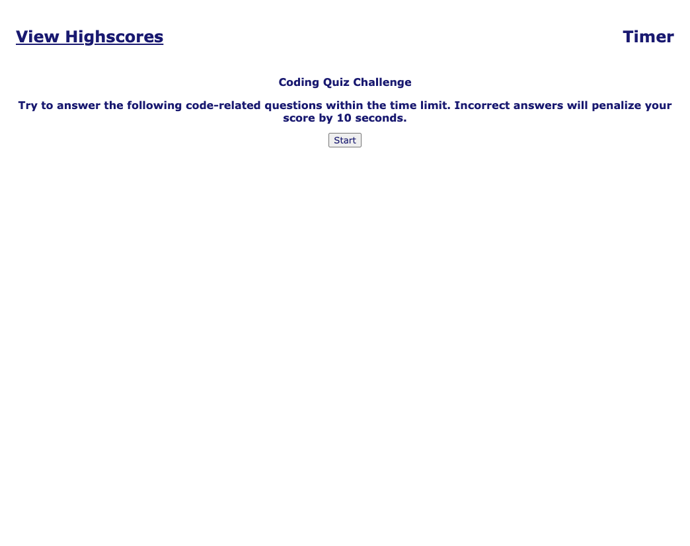

# coding-quiz 

This application is a quiz that can be taken to practice javascript facts.  When you click the start button, a timer counts down from 30 seconds.  If you answer the question correctly, you will earn one point, if you answer it incorrectly, 10 seconds will come off of the timer.  Once all the time runs out or you answer all 5 questions, you will receive a score between 0 and 5.  You can save that score by entering your initials.  You can then retake the quiz or click on the "View Highscore" link to your saved initials and highscore.

## https://github.com/ctolnai/coding-quiz
## https://ctolnai.github.io/coding-quiz/

 

 ## License and copyright

(c) Chris Tolnai 

Licensed under the [MIT License](LICENSE).
